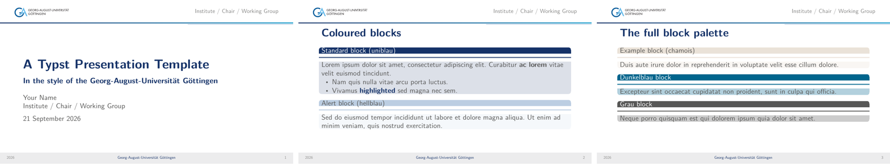

# GAUG Typst Presentation Template

A [Typst](https://typst.app) port of the **Georg-August-Universität Göttingen**
"GAslides" beamer theme (`beamerthemeGA.sty`, v1.0, 2022). Geometry and box
metrics were matched 1:1 against a `pdflatex` render of the original template,
so a deck built here looks like the LaTeX one — but compiles in a fraction of
the time and with far less markup. Typography, the accent blue and the logo
follow the university's current house standards (as agreed with the Göttingen
PR office for this public release).

> **Unofficial port.** This is an independent community port, not an official
> template of the Georg-August-Universität Göttingen, and it is not maintained
> by the university or by le-tex. For the official templates, see the
> university's website.



## Getting started

Create a new presentation with `typst init`:

```sh
typst init @preview/gaug-slides:1.0.0
```

or import the package into an existing document:

```typst
#import "@preview/gaug-slides:1.0.0": *
```

## Requirements

- **Typst** ≥ 0.12 (developed on 0.15) — <https://github.com/typst/typst>
- **Carlito** — the open, Calibri-metric-compatible clone of the university's
  house font. If you have real **Calibri** (Windows/Office), the theme picks it
  up first; otherwise install or add Carlito (see *Fonts*).

### Fonts

The theme requests `("Calibri", "Carlito")`: real Calibri wherever it exists,
Carlito everywhere else — same metrics, near-identical look. Typst Universe
packages cannot bundle fonts, so add or install Carlito yourself: it is on
Google Fonts, ships with LibreOffice, and is `fonts-crosextra-carlito` on
Debian/Ubuntu. In the Typst web app, add it to your font set.

Building from a clone of this repository needs no system install: the four
Carlito faces ship in `fonts/` (SIL OFL — see `fonts/Carlito-LICENSE.txt`) —
just pass `--font-path fonts` (see *Build*).

## Build

```sh
typst compile --font-path fonts example.typ   # -> example.pdf
typst watch   --font-path fonts example.typ   # live preview while editing
```

## Install as a local Typst package

Link (or copy) this repository into Typst's local package directory once, and
every deck on the machine can import it — no copying files per project:

```sh
# macOS
DEST="$HOME/Library/Application Support/typst/packages/local/gaug-slides"
# Linux:  DEST="$HOME/.local/share/typst/packages/local/gaug-slides"
mkdir -p "$DEST" && ln -s "$PWD" "$DEST/1.0.0"
# Windows (PowerShell)
New-Item -ItemType SymbolicLink -Path "$env:APPDATA\typst\packages\local\gaug-slides\1.0.0" -Target $PWD
```

Then, from any folder:

```typst
#import "@local/gaug-slides:1.0.0": *
```

A symlink keeps the package in sync with the repository; bump `version` in
`typst.toml` and add a matching directory when you want to keep old decks
pinned to an older look.

## Usage

Import the package as above, or copy `ga-slides.typ` and `assets/` next to your
own `.typ` file and start from `example.typ`:

```typst
#import "ga-slides.typ": *

#show: ga-slides.with(
  title: "My Talk",
  author: "Your Name",
  short-institute: "Institute / Chair",   // shown at the top-right of each slide
  date: "2026",
)

#title-slide(
  title: "My Talk",
  subtitle: "An optional subtitle",
  author: "Your Name",
  institute: "Institute / Chair",
  date: "21 September 2026",
)

#slide(title: "A content slide")[
  #uniblau-block(title: "A block")[
    - some points
    - #hl[a highlighted phrase]
  ]
]
```

## Components

**Wrappers**

| Function | What it is |
|---|---|
| `ga-slides.with(title:, author:, institute:, short-institute:, date:)` | document wrapper (`#show`) — sets page, furniture, typography |
| `title-slide(title:, subtitle:, author:, institute:, date:)` | the title page |
| `slide(title: "…")[ … ]` | a content slide with an optional frame title |

**Blocks** — coloured, rounded boxes (beamer `beamerboxesrounded`). Each takes
`title:` and optional `title-size:` / `body-size:` (default 11 pt — drop to
9–10 pt on dense slides, as beamer's `\small`/`\footnotesize` would):

- `uniblau-block` — the standard dark-blue block
- `alert-block` — light-blue (hellblau) "alert"
- `example-block` — chamois "example"
- `dunkelblau-block`, `grau-block` — extra colours

**Other**

- `hl[…]` — inline highlight in the university blue.
- `colors` — the full GA palette as a dictionary (`colors.uniblau`,
  `colors.hellblau`, `colors.chamois`, `colors.grau80`, …) for tables, figures
  and custom elements.

## Notes & differences from the LaTeX theme

- The beamer footer **navigation-symbol cluster** is intentionally omitted (it
  is a navigation widget most decks suppress anyway).
- Line breaking is Typst's, not TeX's, so long lines may wrap a word earlier or
  later than the LaTeX original.
- Typography, the accent blue and the headline logo follow the university's
  current house standards (`#005F9B`; Calibri-style Carlito; logo with the
  motto) — updated with the PR office ahead of the public release. The 2022
  LaTeX pack used a darker navy (`#153268`) for its accent.

## Credits & licensing

- Original design: **GAslides** beamer theme, © 2022 Georg-August-Universität
  Göttingen, authored/maintained by le-tex publishing services.
- The GA logo in `assets/logo.svg` (with the motto *in publica commoda*) is the
  property of the Georg-August-Universität Göttingen and is included here with
  the university's permission for this template; its use is restricted to
  members of the university for university purposes. If you use this template
  outside that context, check the university's brand-usage rules and replace
  the logo as needed.
- The Typst port code (`ga-slides.typ`) is released under the MIT License
  (`LICENSE`). This applies to the port only, not to the university's visual
  identity or the original beamer theme.
- The starter files in `template/` (what `typst init` scaffolds into your
  project) are released under the **MIT-0** license
  (<https://opensource.org/license/mit-0>) — no attribution required, adapt
  them freely.
